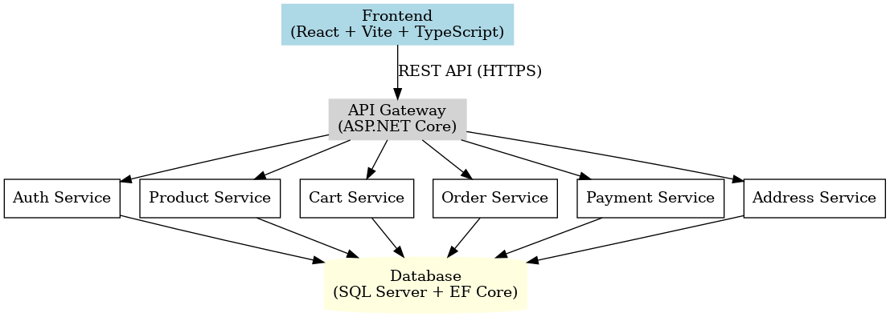

# 🛒 E-Commerce Platform

A full-stack e-commerce application with **React (Vite + TypeScript)** frontend and **ASP.NET Core Web API** backend.  
Features authentication, product management, cart, checkout, orders, payments, and addresses.


## 🚀 Tech Stack

- **Frontend**: React + Vite + TypeScript + TailwindCSS
- **Backend**: ASP.NET Core Web API (C#)
- **Database**: SQL Server with Entity Framework Core
- **Auth**: JWT-based authentication


## 📂 Project Structure

docs/
├── API_Documentation.md
├── Architecture_Diagram.png
├── User_Manual.pdf
└── README.md
backend/
├── Controllers/
├── Data/
├── DTO/
├── Models/
├── Services/
└── Program.cs
frontend/
├── src/
│ ├── components/
│ ├── pages/
│ ├── context/
│ └── services/


## ⚙️ Setup Instructions

### 1️⃣ Backend (ASP.NET Core)

```bash
cd backend
dotnet restore
dotnet ef database update
dotnet run
Runs on https://localhost:5001
```

### 2️⃣ Frontend (React + Vite + TS)

```bash
cd frontend
npm install
npm run dev
Runs on http://localhost:5173
```


## Environment Variables

### Backend (appsettings.json)

```bash
"Jwt": {
  "Key": "SuperSecretKey",
  "Issuer": "ECommerceAPI",
  "Audience": "ECommerceClient"
},
"ConnectionStrings": {
  "DefaultConnection": "Server=.;Database=ECommerceDB;Trusted_Connection=True;"
}
```

### Frontend (.env)

```bash
VITE_API_URL=https://localhost:5001/api
```


## 📖 Features

- 🔐 User Authentication (Register/Login with JWT)
- 👨‍💻 Role-based Access (Customer/Admin)
- 🛍️ Product Management (CRUD by Admin)
- 🛒 Cart Management (Add/Remove/Update Items)
- 📦 Orders & Checkout
- 💳 Payments
- 📍 Address Management
- 📊 Admin Dashboard (View orders, manage products)


## 🌐 API Endpoints

| Method | Endpoint            | Description               | Auth      |
|--------|---------------------|---------------------------|-----------|
| POST   | `/api/auth/register` | Register a new user       | Public    |
| POST   | `/api/auth/login`    | Login & get JWT           | Public    |
| GET    | `/api/product`       | Get all products          | Public    |
| POST   | `/api/product`       | Create new product        | Admin     |
| GET    | `/api/cart`          | Get current user cart     | Customer  |
| POST   | `/api/orders/checkout` | Checkout & create order | Customer  |
| POST   | `/api/payments`      | Make payment for order    | Customer  |

## 📸 Screenshots



## 🔮 Future Improvements
- Integrate real Stripe/PayPal for payments
- Implement email notifications
- Deploy to Azure (Backend) & Vercel/Netlify (Frontend)
